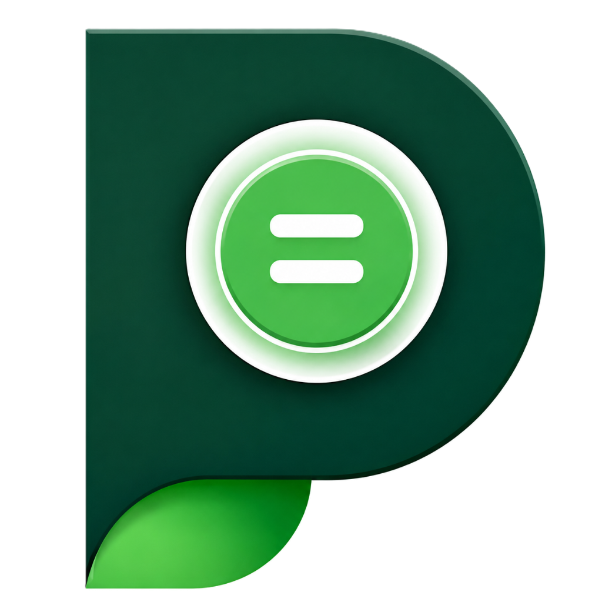

<a name="top"></a>
[](https://developer.android.com/about/versions/nougat)
[](https://kotlinlang.org/)
[](#)
[](#)
[](LICENSE)

## PesaSense — Intelligent, Private M-PESA Financial Tracker

Turn your M-PESA SMS messages into a clean, searchable, and highly visual financial timeline. 100% private, zero cloud processing.

[](https://x.com/intent/tweet?text=Check%20out%20PesaSense%20-%20Privacy-first%20M-PESA%20expense%20tracker!%20%23Android%20%23PrivacyFirst%20%23MPESA)
[](https://www.linkedin.com/sharing/share-offsite/?url=https://github.com/DanielX8/PesaSense-Budget-and-M-pesa-Tracker)

<div align="center">
  
</div>

## Overview

Your phone already receives a text for every M-PESA transaction you make. PesaSense securely reads those messages to build a comprehensive, zero-setup expense tracker. No accounts, no manual entry, and no cloud syncing required.

### 🚀 Coming Soon To:


---

### How it works

1. **Grant SMS Permission** (Read-only) — No account creation, no cloud syncing, your data never leaves your device.
2. **Instant Transaction Parsing** — PesaSense reads your M-PESA messages in real-time, extracting amounts, payees, transaction fees, and dates.
3. **Gain Deep Insights** — Instantly view your spending habits, track your budgets, and monitor your financial goals.

## Why PesaSense?

### 🔑 Key Differentiators
- **🔒 100% On-Device & Private** — All SMS parsing and analytics happen locally on your phone. No servers, no tracking.
- **🇰🇪 Built for M-PESA** — Specifically tailored for Kenya's leading mobile money platform. It understands "Send Money", "Buy Goods", "Paybill", and even "Fuliza".
- **⚡ Zero Setup** — Just grant the necessary permissions and your financial dashboard is built instantly.

### 🌟 Core Features
- **🤖 Smart SMS Parsing** — Automatically strips away unnecessary numbers and characters to give you clean merchant and payee names.
- **📊 Visual Analytics** — Dive into your spending with beautiful bar charts, dynamic donut charts, and spending leak meters.
- **💰 Budget Planner** — Set limits for your spending. PesaSense tracks your progress and visually warns you when you approach your thresholds.
- **🎯 Financial Goals** — Dedicated trackers to help you save up for that new gadget or pay off debts smoothly.
- **💸 Fee Tracking** — Keep an eye on the hidden costs. PesaSense explicitly tracks your M-PESA transaction fees.

### ✨ More Features
- **🌗 Dynamic Theming** — Gorgeous Material Design 3 UI with seamless transitions between Light and Dark modes.
- **💳 Clean UI Navigation** — Custom, visually striking vector icons that provide a premium user experience.
- **📦 Room Database** — Lightning-fast local storage for all your categorized transactions.

## Tech Stack
*   **Language**: Kotlin
*   **UI Framework**: Jetpack Compose (Material Design 3)
*   **Architecture**: MVVM (Model-View-ViewModel)
*   **Local Database**: Room Database
*   **Asynchrony**: Kotlin Coroutines & Flow

## Getting Started / Installation

1.  **Clone the repository:**
    ```bash
    git clone https://github.com/DanielX8/PesaSense-Budget-and-M-pesa-Tracker.git
    cd PesaSense-Budget-and-M-pesa-Tracker
    ```
2.  **Open in Android Studio:**
    *   Launch Android Studio.
    *   Select `File > Open` and choose the cloned directory.
3.  **Build and Run:**
    *   Sync the project with Gradle files.
    *   Select your emulator or physical device.
    *   Click the **Run** button (`Shift + F10`).

## Usage Example
Once installed, grant the necessary SMS permissions to allow the app to sync your transaction data:
```kotlin
// The app will prompt for the following permission dynamically
<uses-permission android:name="android.permission.READ_SMS" />
```
Navigate to the **Settings** tab and tap **Sync MPESA Data** to populate your dashboard automatically.
