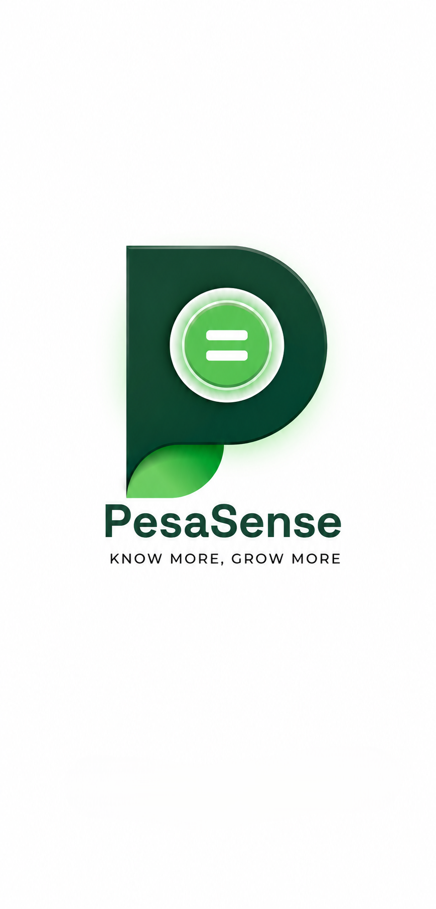

# PesaSense Studio
**Intelligent financial tracking and seamless analytics, right at your fingertips.**



## Core Features
*   **Automated Expense Tracking**: Securely sync and parse your MPESA transaction SMS data locally.
*   **Intelligent Analytics**: Gain deep insights through beautiful, visual charts and comprehensive transaction history.
*   **Budget Planner**: Set limits and receive smart alerts when you're nearing your budget threshold.
*   **Financial Goals Tracking**: Dedicated trackers to help you save up for goals or pay off debts smoothly.
*   **Dynamic Theming**: Gorgeous adaptive UI with seamless transitions between Light and Dark mode.
*   **Privacy-First**: No data leaves your device. Your financial information stays strictly local.

## Tech Stack
*   **Language**: Kotlin
*   **UI Framework**: Jetpack Compose (Material Design 3)
*   **Architecture**: MVVM (Model-View-ViewModel)
*   **Local Database**: Room Database
*   **Asynchrony**: Kotlin Coroutines & Flow

## Getting Started / Installation

1.  **Clone the repository:**
    ```bash
    git clone https://github.com/your-username/pesasense-studio.git
    cd pesasense-studio
    ```
2.  **Open in Android Studio:**
    *   Launch Android Studio.
    *   Select `File > Open` and choose the `pesasense-studio` directory.
3.  **Build and Run:**
    *   Sync project with Gradle files.
    *   Select your emulator or physical device.
    *   Click the **Run** button (`Shift + F10`).

## Usage Example
Once installed, grant the necessary SMS permissions to allow the app to sync your transaction data:
```kotlin
// The app will prompt for the following permission dynamically
<uses-permission android:name="android.permission.READ_SMS" />
```
Navigate to the **Settings** tab and tap **Sync MPESA Data** to populate your dashboard automatically.

---

### GitHub "About" Sidebar Recommendations
When setting up this repository on GitHub, don't forget to populate your right sidebar:
*   **Description**: *A privacy-first Android application built with Jetpack Compose for seamless MPESA transaction tracking, budget planning, and financial analytics.*
*   **Website Link**: (Leave blank for now, or link to a demonstration video/portfolio)
*   **Topics/Tags**: `android`, `kotlin`, `jetpack-compose`, `finance-tracker`, `mpesa`, `material-design-3`, `offline-first`
